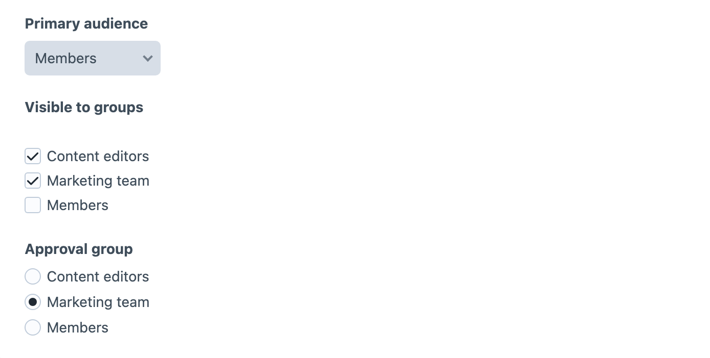

<!-- feature-intro -->
User Group Field makes Craft’s user groups available as content. Let authors select one or several groups, then use those choices in templates, notifications, access rules, or project-specific workflows.
<!-- feature-intro-end -->

<!-- feature-section media-size="large" -->
## User groups as content

Add the field to an entry, user, global set, or another supported layout and choose whether it accepts one group or several. Authors select from the user groups already configured for the Craft project.

<!-- feature-section-end -->

<!-- feature-section -->
## Structured group data

Templates receive group models rather than a copied label, keeping handles and project configuration available for conditional presentation or custom application logic. Selected groups can also appear in supported element indexes, and element queries can filter by a user-group UID.
<!-- feature-section-end -->
